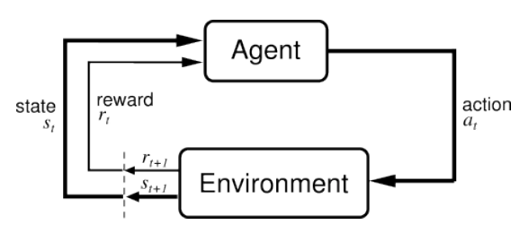
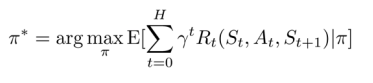
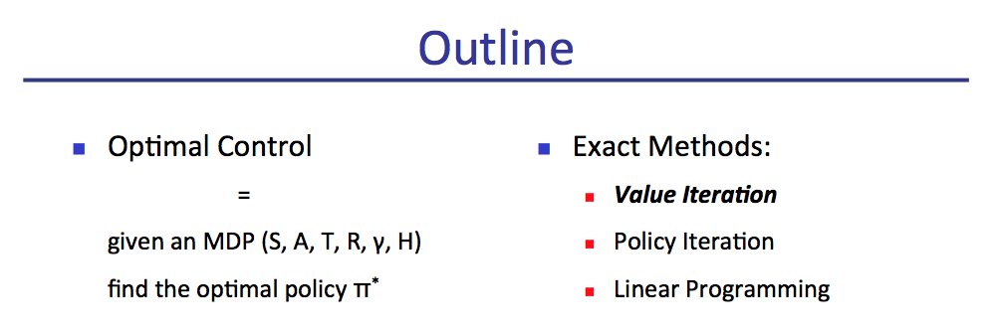
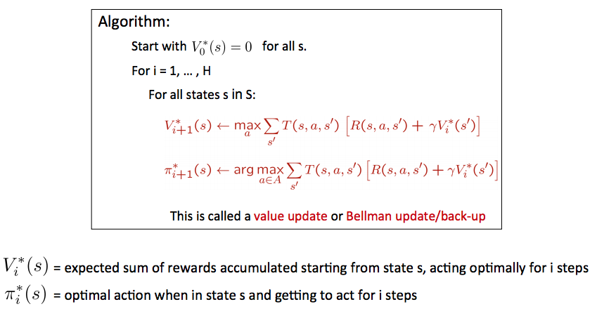
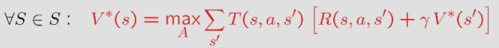
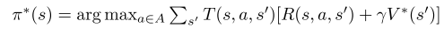

<!-- MarkdownTOC autolink="true" bracket="round" markdown_preview="markdown" -->

# CS 287: Advanced Robotics

 
Geonhee Lee
 
gunhee6392@gmail.com

## Lecture 1: Introduction

성공적인 robotic stories 및 이 강좌에서 다루는 material과 연결.

1. Driverless Cars _[Darpa Grand Challenge, Darpa Urban Challenge, Google Self-Driving Car, ...]_
   -    Kalman filtering, LQR, mapping, terrain & object recognition.

2. Autonomous Helicopter Flight _[Abbeel, Coates & Ng]_
   -    Kalman filtering, model-predictive control, LQR, system ID, trajectory learning.

3. Four-legged	locomotion _[Kolter, Abbeel & Ng]_
   -    value iteration, receding horizon control, motion planning,	inverse reinforcement learning, nolearning, learned.
4. Two-legged locomotion _[Tedrake +al.]_
   -   Policy gradient.

5. Mapping
   -   FastSLAM: particle filter + occupancy grid mapping.
  
6. Mobile	Manipulation _[Quigley, Gould, Saxena, Ng + al.]_ , _[Maitin-Shepard, Cusumano-Towner, Lei, Abbeel,	2010]_
   - SLAM, localization, motion planning for navigation and grasping, grasp point selection, visual category recognition (speech recognition and synthesis)
   - localization, motion planning for navigation and grasping, grasp point selection, visual recognition

7. Visuomotor	Learning _[Levine*, Finn*, Darrell, Abbeel, 2015]_
   -   LQR,	guided	policy	search,	deep learning

8. Learned	Visuomotor	Skills  _[Levine*, Finn*, Darrell, Abbeel, 2015]_
   -   LQR,	guided	policy	search,	deep learning

9.  Learning Locomotion _[Schulman, Moritz, Levine,	Jordan, Abbeel, 2015]_
   -   policy gradients, value function approximation	

------

Why a Great Time to Study CS287 Advanced Robotics?	

-   다양한 robotic 시스템이 있지만, 몇 가지 핵심 기술이면 충분하다.
    -   Probabilistic Reasoning
    -   Optimization
-   이러한 기술의 응용은 robotics를 넘어 잘 확장됨

-----

## Lecture 2: Markov Decision Processes	and	Exact Solution Methods: Value Iteration, Policy Iteration, Linear Programming

Markov Decision Process (S, A, T, R, $\gamma$ , H)

- 가정: Agent는 state를 관측하게 된다.
  

 
    

**Given**
-   S: state 집합
-   A: action 집합
-   T: S x A x S x {0, 1, ..., H} $\rightarrow$ [0, 1]
    -   T$_t$ (s, a, s') = P ( $s _{t+1} = s' | s _t , a _t = a$ )
-   R: S x A x S x {0, 1, ..., H} $\rightarrow$ $\mathbb{R}$
    -   R$_t$ (s, a, s') =  reward for ( $s _{t+1} = s' , s _t , s _t = s a _t = a$ )
-   $\gamma$ in (0, 1]: discount factor
-   H: agent가 행동하게 될 horizon

**Goal**

-   $\pi ^*$ 찾기 $\rightarrow$ expected sum of reward를 최대화 하는 것 : S x {0, 1, ..., H}, i.e.,

 
    

### __Solving MDPs__

-   MDP에서, **optimal policy ( $\pi ^*$ : S x 0:H $\rightarrow$ A** )를 찾기를 원함.
    -   Policy $\pi$ 는 각 time에서 각 state에 대한 action을 제공.
    -   Optimal policy는 expected sum of rewards를 최대화.
-   차이: deterministic이라면, 시작점부터 목표지점까지 optimal **plan** (혹은 action의 sequence)가 필요함.

------

 
    

지금까지 다룬 descrete state-action space는 주요 개념을 이해하기 더욱 쉬웠고, 이후 continous space를 나중에 고려할 것.

### __Value Iteration__

 
    

### __Value Iteration Convergence__

> Theorem.  Value iteration은 수렴. 
> >  수렴지점에서, Bellman equation을 만족하는 discounted infinite horizon 문제에 대해서 optimal value function $V ^*$ 을 찾는다.

 
    

-   Discounted reward를 가진 infinite horizon에 대해 어떻게 행동해야지 안다
    -   수렴할때까지 value iteration을 실행.
    -   $V ^*$ 를 생성하고, $V ^*$ 는 다음과 같이 행동하는 방법을 알려준다.

 
    

-   Note: infinite horizon optimal policy는 stationary, 즉, 각 state $s$에서 optimal action은 항상 같은 action. (저장하기 효율적)

 
 
 

### Convergence: Intuition

-   $V ^* (s)$ = state s에서부터 $\infty$ step에서 optimally 행동하여 축적되는 보상의 expected 합.
-   $V ^* _H (s)$ = state s에서부터 H step동안 축적되는 보상의 expected 합.

 추가적으로 다음 horizon에 걸쳐 수집되는 보상들이 있으며, H가 무한대로 가게되면, $V ^* _H (s)$ 는 $V ^* (s)$ 이 된다.

### Convergence and Contractions

- max-norm 정의: $\left \| U \right \|$ = max $_x |U(s)|$

> Theorem: 두 개의 근사 U, V에 대하여,
> > $\left \| U _{i+1} - V _i \right \|$ $\leq$ $\gamma \left \| U _i - V _i \right \|$
> > 즉, 어떤 구별된 근사화는 더욱더 가까워져야하고, 특히, 

### __Policy Evaluation__

### __Policy Iteration__

## Lecture3 (Discretization)

Continious State Spaces

-   S = continuous set
-   Value iteration은 모든 state들에 대해서 계산하기에는 비현실적(불가능).

  Markov chain approximation을 통해 continousous state space dynamics model로 변환("discretization)
    -   Grid the state-space: vertice(꼭지점, 정점)가 discrete state.
    -   action space를 finite set으로 축소
        -   어떤 경우들에서는 필요가 없다
            -   Bellman back-up이 continous action space에 걸쳐 정확히 계산될때.
            -   optimal policy의 부분인 오직 하니의 특정 제어를 알때.
    -   Transition function은 이후에 다룰것.

$\qquad$$\qquad$        

 
 
 

---------

## Reference

1. [CS 287 - Advanced Robotics](https://people.eecs.berkeley.edu/~pabbeel/cs287-fa15/)